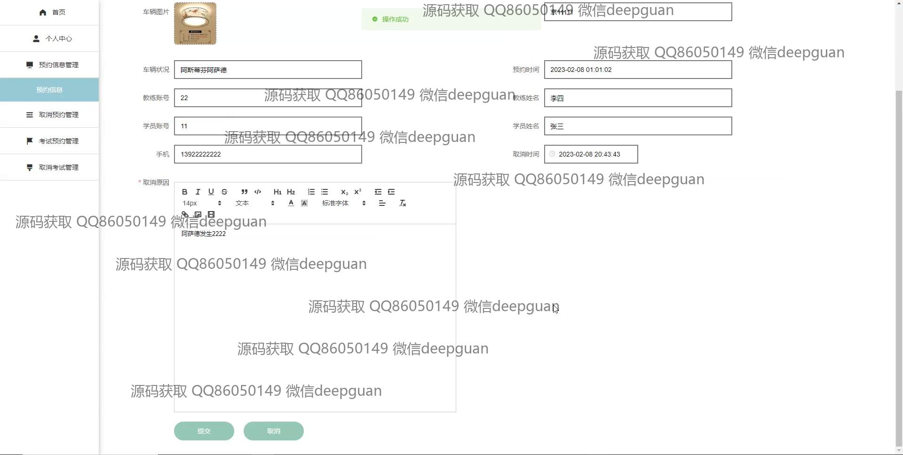

<h1 align="center">驾校管理系统</h1>

## 简介
驾校管理系统：角色分为学员、教练、管理员；功能包括学员管理、车辆管理、考试安排、预约信息管理、公告发布、驾驶知识查询，旨在实现高效便捷的驾校运营管理。    --计算机毕业设计源码；毕设源码；java毕业设计源码

## 联系方式

<h3 align="center">获取完整代码与数据库文件 + 微信：deepguan QQ: 86050149 QQ群: 783742310</h3>

<h3 align="center">可帮忙远程部署 包运行成功！提供远程部署、修改代码、设计文档指导、代码讲解等服务！</h3>

## 功能介绍（完整见运行截图）
管理员：登录和注册系统，管理学员信息，课程安排，考试预约，车辆分配，发布和管理公告，修改系统设置。用户界面简洁直观，提供详细的统计分析功能，方便驾校日常事务的有效管理。支持编辑考试信息、车辆管理和公告内容，优化管理流程，提高工作效率。用户：可以通过注册和登录访问平台，查看和修改个人信息，预约课程和考试，获取驾校公告和考试安排等资讯。个人中心便于管理个人资料和学习进度，通过平台内容了解驾校动态和课程信息。教练：管理学员课程和考试预约，查看和编辑个人信息，便捷管理其所负责的学员和车辆使用情况。支持通过平台安排和取消课程，提高安排效率，帮助学员更好地备考。学员：注册后可登录查看个人信息，预约课程和考试，了解考试安排和相关信息，支持查看和管理学习进度。界面友好，便于获取驾校公告和课程信息，辅助提高学习和备考效率。

## 运行截图

本代码来源于网络,仅供学习参考使用!

